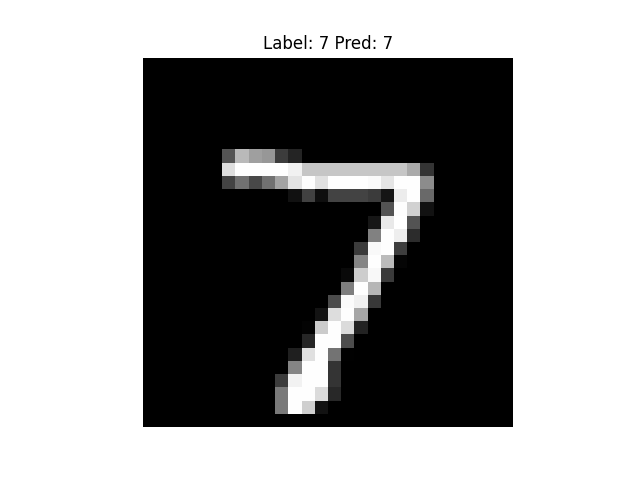

# Simple CNN on MNIST (PyTorch)

A beginner-friendly **Convolutional Neural Network (CNN)** built with PyTorch to classify handwritten digits from the **MNIST dataset**.  
The model achieves ~98–99% test accuracy after a few training epochs.

---

## Project Structure
```text
cnn-project/
│── models/             # saved model weights (.pth) [gitignored]
│── src/
│   ├── model.py        # CNN architecture
│   ├── train.py        # training loop
│   ├── test.py         # reload + evaluation
│   └── utils.py        # helper functions (save/load, evaluate, visualize)
│── README.md
│── requirements.txt
│── .gitignore
Requirements
Python 3.9+

PyTorch

torchvision

matplotlib

Install dependencies:

bash
Copy
Edit
pip install -r requirements.txt
Usage
1. Train the model
bash
Copy
Edit
python src/train.py
Trains the CNN on MNIST

Prints training loss & test accuracy

Saves weights to models/mnist_cnn.pth

2. Test the model
bash
Copy
Edit
python src/test.py
Reloads the saved model

Evaluates test set accuracy

Prints prediction on a sample image

Sample Output
yaml
Copy
Edit
Epoch 1/5 - train loss: 0.1126
Epoch 2/5 - train loss: 0.0398
Epoch 3/5 - train loss: 0.0276
Epoch 4/5 - train loss: 0.0207
Epoch 5/5 - train loss: 0.0143
Accuracy: 98.89%
Predicted: 7, Actual: 7
Example Prediction
Here’s a sample MNIST digit and the model’s prediction:


Next Steps
Visualize misclassified digits

Try Fashion-MNIST or CIFAR-10

Add dropout & batch normalization for better generalization

Deploy with Flask/Streamlit (draw a digit → get prediction live)

Credits
Dataset: MNIST

Framework: PyTorch

yaml
Copy
Edit

---

## ✅ What to Do
1. Open your file:
```bash
nano README.md
Replace everything with the version above.

Save (Ctrl+O → Enter → Ctrl+X)

Commit & push:

bash
Copy
Edit
git add README.md
git commit -m "Clean final README"
git push
